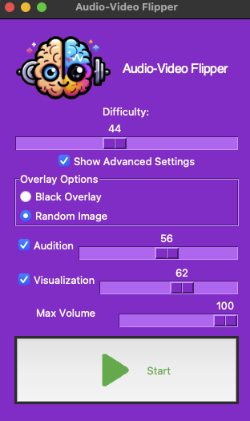

# Audio-Video Flipper: Cognitive and Sensory Enhancement Platform

## Installation Instructions
1. Download the repository from GitHub or clone it using `git clone https://github.com/keithorange/AudioVideoFlipper_Imagination_Gym.git`
2. Unzip the folder (if downloaded as a ZIP file)
3. Navigate to the project directory in the terminal `cd AudioVideoFlipper_Imagination_Gym` or file explorer
4. Install the required dependencies with `pip install -r requirements.txt`
5. Run the application by executing the main script (e.g., `python start_flipper_ui.py`)

## Overview

The Audio-Video Flipper is a cutting-edge cognitive training tool designed to enhance auditory and visual faculties alongside improving key cognitive functions such as memory, focus, attention, and sensory processing. This platform offers a unique method for engaging with media, turning passive watching into an active cognitive exercise.

## Features

### Dynamic Auditory and Visual Exercises
- **Auditory Training:** Adjustable settings allow users to customize auditory challenges, enhancing auditory processing and concentration skills.
- **Visual Training:** Users can modify visual stimuli levels to engage in a variety of visual processing tasks, improving visual attention and adaptability.

### Tailored Difficulty
- Customizable difficulty settings ensure that users from any starting point can progressively challenge themselves, enhancing their cognitive abilities in a structured manner.

### Overlay Options for Visual Modulation
- **Opaque Overlay:** Reduces visual distractions, focusing on auditory processing.
- **Black Overlay:** Maximizes contrast, sharpening visual focus in a high-contrast environment.
- **Random Image Overlay:** Introduces unpredictable visual stimuli, enhancing adaptability and processing speed.

### Session Customization
- Users can define maximum volume levels and session durations to create a personalized and comfortable training environment.

### Real-Time Adjustability
- Adjust settings on-the-fly to cater to changing training needs or to focus on specific cognitive objectives during a session.

## How It Works

The tool integrates auditory and visual stimuli, which users interact with, challenging their cognitive processing. These stimuli are adjustable in complexity and intensity, providing a scalable platform for cognitive development.

### Engaging with Media
- Utilize the tool while watching favorite movies, TV shows, or scenes. The flipper adds a cognitive layer to the viewing experience, enhancing imagination and sensory processing as the mind fills in the gaps created by the altering stimuli.

## Cognitive Benefits
- **Imagination and Creativity:** Enhances the ability to visualize and create, benefiting creative pursuits and problem-solving.
- **Auditory and Visual Sharpness:** Improves the ability to process and adapt to changing auditory and visual environments, useful in everyday life and specific domains like sports or performing arts.
- **Cognitive Maintenance:** Aids in maintaining and improving cognitive functions, potentially offsetting age-related cognitive decline.
- **Mindfulness and Focus:** Encourages a state of active engagement and mindfulness, reducing passive consumption and enhancing concentration.

## Important Considerations
- **Positive Engagement:** Choose content that is positive and enjoyable. The mind's ability to fill in sensory gaps means that the content will have a significant impact on your cognitive exercise.
- **Safety and Well-being:** Always prioritize safety and comfort, avoiding overstimulation and adhering to personal limits.

## Safety Guidelines and Disclaimers
- **User Discretion:** The effectiveness and safety of this tool can vary; users should exercise caution and consider personal health conditions, such as epilepsy or sensory processing disorders.
- **Moderation:** Avoid prolonged sessions to prevent cognitive fatigue. Discontinue use if any discomfort or disorientation is experienced.
- **Post-Session Activities:** Refrain from activities requiring high mental acuity, such as driving, immediately after a session.
- **Substance Interference:** Ensure not to use the tool under the influence of substances that could impair cognitive or sensory processing.

## Conclusion

The Audio-Video Flipper offers an innovative approach to cognitive training, leveraging everyday media consumption as an opportunity for cognitive enhancement. By incorporating this tool into regular media viewing habits, users can transform passive activities into powerful exercises for the mind, fostering cognitive growth, sensory adaptability, and creative thinking. Remember, the key to effective cognitive training is consistency, positivity, and mindfulness in engagement.

## Installation Instructions
1. Download the repository from GitHub or clone it using `git clone https://github.com/keithorange/AudioVideoFlipper_Imagination_Gym.git`
2. Unzip the folder (if downloaded as a ZIP file)
3. Navigate to the project directory in the terminal `cd AudioVideoFlipper_Imagination_Gym` or file explorer
4. Install the required dependencies with `pip install -r requirements.txt`
5. Run the application by executing the main script (e.g., `python start_flipper_ui.py`)

